# Tugas Praktikum { Pertemuan ke 10 } 


|**Nama**|**NIM**|**Kelas**|**Matkul**|
|----|---|-----|------|
|Muhammad Ikhsan Fakhrudin|312210019|TI.22.A.2|Basis Data|

# Soal Latihan Praktikum ( Pegawai )


**Perintah SQL :**

```
CREATE TABLE Pegawai (
  id_pegawai VARCHAR(5) PRIMARY KEY,
  nama_depan VARCHAR(50),
  nama_belakang VARCHAR(50),
  email VARCHAR(100),
  telepon VARCHAR(20),
  tgl_kontrak DATE,
  id_job VARCHAR(5),
  gaji INT,
  tunjangan INT
);

INSERT INTO Pegawai (id_pegawai, nama_depan, nama_belakang, email, telepon, tgl_kontrak, id_job, gaji, tunjangan)
VALUES	('E001', 'Ferry', 'Gustiawan', 'ferry@yahoo.com', '07117059004', '2005-09-01', 'L0001', 2000000, 500000),
	('E002', 'Aris', 'Ganiardi', 'aris@yahoo.com', '081312345678', '2006-09-01', 'L0002', 2000000, 200000),
	('E003', 'Faiz', 'Ahnad', 'faiz@gmail.com', '081367384322', '2006-10-01', 'L0003', 1500000, NULL),
	('E004', 'Emna', 'Bunton', 'emna@gmail.com', '081363484342', '2006-10-01', 'L0004', 1500000, 9),
	('E005', 'Mike', 'Scoff', 'mike@plasa.com', '08163454555', '2007-09-01', 'L0005', 1250000, 9),
	('E006', 'Lincoln', 'Burrows', 'linc@yahoo.com', '08527388432', '2008-09-01', 'L0006', 1750000, NULL);
SELECT * FROM Pegawai;
```

***Output***

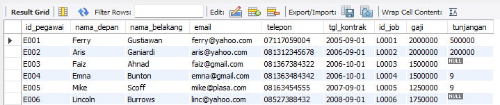

## Tugas Praktikum

**1. Tampilkan pegawai yang gajinya bukan 2.000.000 dan 1.250.000 !**

`SELECT * FROM Pegawai WHERE gaji NOT IN (2000000, 1250000);`

***Output***

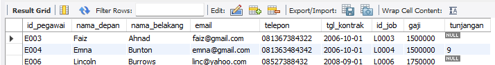

**2. Tampilkan pegawai yang tunjangannya NULL!**

`SELECT * FROM Pegawai WHERE tunjangan IS NULL;`

***Output***

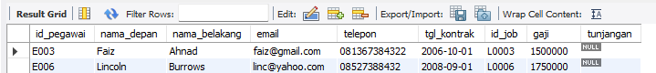

**3. Tampilkan pegawai yang tunjangannya tidak NULL!**

`SELECT * FROM Pegawai WHERE tunjangan IS NOT NULL;`

***Output***

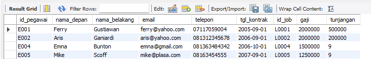

**4. Tampilkan/hitung jumlah baris/record tabel pegawai!**

`SELECT COUNT(*) AS jumlah_pegawai FROM Pegawai;`

***Output***

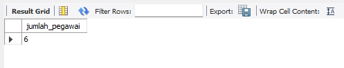

**5. Tampilkan/hitung jumlah total gaji di tabel pegawai!**

`SELECT SUM(gaji) AS total_gaji FROM Pegawai;`

***Output***


**6. Tampilkan/hitung rata-rata gaji pegawai!**

`SELECT AVG(gaji) AS rata_rata_gaji FROM Pegawai;`

***Output***

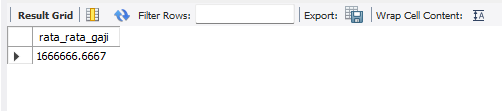

**7. Tampilkan gaji terkecil!**

`SELECT MIN(gaji) AS gaji_terkecil FROM Pegawai;`

***Output***

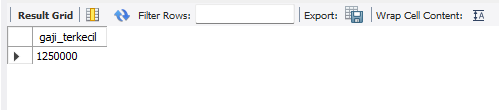

**8. Tampilkan gaji terbesar!**

`SELECT MAX(gaji) AS gaji_terbesar FROM Pegawai;`

***Output***

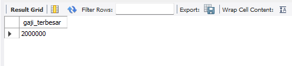

# Soal Latihan Praktikum ( Animals )


**Perintah SQL :**

```
CREATE TABLE Animals (
  id VARCHAR(2),
  name VARCHAR(20),
  owner VARCHAR(20),
  species VARCHAR(20),
  sex CHAR(1)
);

INSERT INTO Animals (id, name, owner, species, sex)
VALUES ('p1', 'Puffball', 'Diane', 'Hamster', 'F'),
       ('p2', 'Claws', 'Gwen', 'Cat', 'M'),
       ('p3', 'Fluffy', 'Haro 1d', 'Cat', 'F'),
       ('p4', 'Buffy', 'Haro 1d', 'Dog', 'F'),
       ('p5', 'Fang', 'Benny', 'Dog', 'M'),
       ('p6', 'Bowser', 'Diane', 'Dog', 'M'),
       ('p7', 'Chirpy', 'Gwen', 'Bird', 'F'),
       ('p8', 'Whistler', 'Gwen', 'Bird', NULL),
       ('p9', 'Slim', 'Benny', 'Snake', 'M');
SELECT * from Animals;
```

***Output***

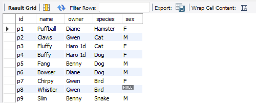

## Tugas Praktikum

**1. Tampilkan jumlah hewan yang dimiliki setiap owner.**

`SELECT owner, COUNT(*) AS jumlah_hewan FROM Animals GROUP BY owner;`

***Output***

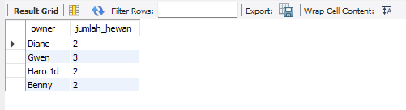

**2. Tampilkan jumlah hewan berdasarkan spesies**

`SELECT species, COUNT(*) AS jumlah_hewan FROM Animals GROUP BY species;`

***Output***

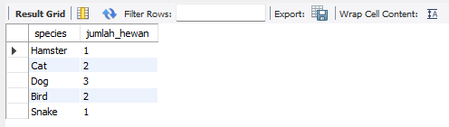

**3. Tampilkan jumlah hewan berdasarkan jenis kelamin**

`SELECT sex, COUNT(*) AS jumlah_hewan FROM Animals GROUP BY sex;`

***Output***


**4. Tampilkan jumlah hewan berdasarkan spesies dan jenis kelamin**

`SELECT species, sex, COUNT(*) AS jumlah_hewan FROM Animals GROUP BY species,`

***Output***

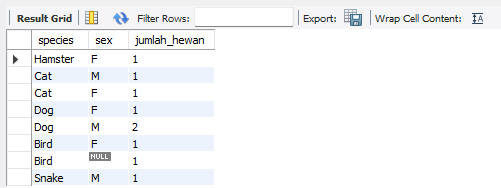

**5. Tampilkan jumlah hewan berdasarkan spesis (cat dan dog saja) dan jenis kelamin**

`SELECT species, sex, COUNT(*) AS jumlah_hewan FROM Animals WHERE species`

***Output***

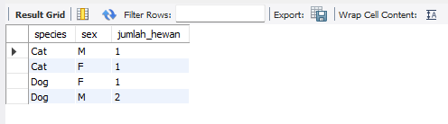

**6. Tampilkan jumlah hewan berdasarkan jenis kelamin yang diketahui saja**

`SELECT sex, COUNT(*) AS jumlah_hewan FROM Animals WHERE sex IS NOT NULL `

***Output***

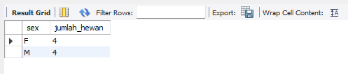

### Tulis semua perintah-perintah SQL percobaan di atas beserta outputnya!

```
CREATE DATABASE praktikum4;
USE praktikum4;
CREATE TABLE Pegawai (
  id_pegawai VARCHAR(5) PRIMARY KEY,
  nama_depan VARCHAR(50),
  nama_belakang VARCHAR(50),
  email VARCHAR(100),
  telepon VARCHAR(20),
  tgl_kontrak DATE,
  id_job VARCHAR(5),
  gaji INT,
  tunjangan INT
);

INSERT INTO Pegawai (id_pegawai, nama_depan, nama_belakang, email, telepon, tgl_kontrak, id_job, gaji, tunjangan)
VALUES	('E001', 'Ferry', 'Gustiawan', 'ferry@yahoo.com', '07117059004', '2005-09-01', 'L0001', 2000000, 500000),
		('E002', 'Aris', 'Ganiardi', 'aris@yahoo.com', '081312345678', '2006-09-01', 'L0002', 2000000, 200000),
		('E003', 'Faiz', 'Ahnad', 'faiz@gmail.com', '081367384322', '2006-10-01', 'L0003', 1500000, NULL),
		('E004', 'Emna', 'Bunton', 'emna@gmail.com', '081363484342', '2006-10-01', 'L0004', 1500000, 9),
		('E005', 'Mike', 'Scoff', 'mike@plasa.com', '08163454555', '2007-09-01', 'L0005', 1250000, 9),
		('E006', 'Lincoln', 'Burrows', 'linc@yahoo.com', '08527388432', '2008-09-01', 'L0006', 1750000, NULL);
SELECT * FROM Pegawai;
SELECT * FROM Pegawai WHERE gaji NOT IN (2000000, 1250000);
SELECT * FROM Pegawai WHERE tunjangan IS NULL;
SELECT * FROM Pegawai WHERE tunjangan IS NOT NULL;
SELECT COUNT(*) AS jumlah_pegawai FROM Pegawai;
SELECT SUM(gaji) AS total_gaji FROM Pegawai;
SELECT AVG(gaji) AS rata_rata_gaji FROM Pegawai;
SELECT MIN(gaji) AS gaji_terkecil FROM Pegawai;
SELECT MAX(gaji) AS gaji_terbesar FROM Pegawai;

CREATE TABLE Animals (
  id VARCHAR(2),
  name VARCHAR(20),
  owner VARCHAR(20),
  species VARCHAR(20),
  sex CHAR(1)
);

INSERT INTO Animals (id, name, owner, species, sex)
VALUES ('p1', 'Puffball', 'Diane', 'Hamster', 'F'),
       ('p2', 'Claws', 'Gwen', 'Cat', 'M'),
       ('p3', 'Fluffy', 'Haro 1d', 'Cat', 'F'),
       ('p4', 'Buffy', 'Haro 1d', 'Dog', 'F'),
       ('p5', 'Fang', 'Benny', 'Dog', 'M'),
       ('p6', 'Bowser', 'Diane', 'Dog', 'M'),
       ('p7', 'Chirpy', 'Gwen', 'Bird', 'F'),
       ('p8', 'Whistler', 'Gwen', 'Bird', NULL),
       ('p9', 'Slim', 'Benny', 'Snake', 'M');
SELECT * from Animals;
SELECT owner, COUNT(*) AS jumlah_hewan FROM Animals GROUP BY owner;
SELECT species, COUNT(*) AS jumlah_hewan FROM Animals GROUP BY species;
SELECT sex, COUNT(*) AS jumlah_hewan FROM Animals GROUP BY sex;
SELECT species, sex, COUNT(*) AS jumlah_hewan FROM Animals GROUP BY species, sex;
SELECT species, sex, COUNT(*) AS jumlah_hewan FROM Animals WHERE species IN ('Cat', 'Dog') GROUP BY species, sex;
SELECT sex, COUNT(*) AS jumlah_hewan FROM Animals WHERE sex IS NOT NULL GROUP BY sex;
```

### Berikan Kesimpulan Anda !

Terdapat beberapa ***Query Filter*** yang ditemukan pada tugas praktikum 4 :

- Operator `IN` digunakan untuk memfilter data yang terdapat pada list IN
- Operator `NOT IN` digunakan untuk memfilter data yang tidak terdapat pada list IN
- Operator `IS NULL` digunakan untuk menampilkan data dengan nilai data NULL
- Operator IS NOT NULL digunakan untuk menampilkan data dengan nilai data tidak NULL
- `COUNT` adalah perintah yang digunakan untuk menghitung jumlah baris suatu kolom pada tabel.
- `SUM` adalah perintah yang digunakan untuk menghitung jumlah nilai suatu kolom pada tabel.
- `AVG` adalah perintah yang digunakan untuk menghitung rata-rata dari nilai suatu kolom pada tabel.
- `MIN` adalah perintah yang digunakan untuk menampilkan nilai terkecil dari suatu kolom pada tabel.
- `MAX` adalah perintah yang digunakan untuk menampilkan nilai terbesar dari suatu kolom pada tabel.
- Klausa `GROUP BY` berfungsi untuk mengelompokkan data berdasarkan field tertentu.

### SELESAI 

